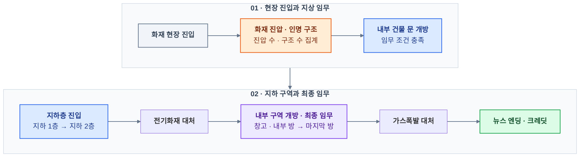

# VR 소방·인명 구조 — Unreal Engine 5 개인 프로젝트

소방관이 되어 화재 현장에 진입하고, **화재 진압·인명 구조·산소 관리**를 수행하는 **1인칭 VR 개인 창작 게임**입니다. VR 컨트롤러로 소방호스를 조작하며, 제한된 산소와 화상에 따른 이동 저하를 고려해 지상·지하 구역의 임무를 진행합니다.
**VR 플레이어·소방 장비**부터 **생존·구조·퀘스트 로직**, **레벨 구성**, **UI·음성·엔딩 연출**까지 Blueprint로 구현했습니다.
## [GitHub Repository](https://github.com/Nu-LungJi/UnrealVR-Personal-Project)
## [게임 1분 트레일러 (Trailer)](https://youtu.be/4lPh4s-BTnA)
## [게임 시연 영상 (Demo Video)](https://youtu.be/IZhNlxoRTyE)

## [게임 발표자료 (PDF)](https://github.com/Nu-LungJi/UnrealVR-Personal-Project/blob/main/README%20UNREAL%20VR%20INDIV-%20Presentation.pdf)

| 항목     | 내용                                                                              |
| ------ | ------------------------------------------------------------------------------- |
| 개발 기간  | 2024.12.02 ~ 2025.05.26 (약 6개월)                                                 |
| 개발 인원  | 1인 — 게임 기획·블루프린트 구현·레벨 구성·연출 통합 담당                                              |
| 플랫폼    | Windows PC / x64 · VR                                                           |
| 장르     | 1인칭 소방·인명 구조                                                                    |
| 플레이 구성 | 현장 진입 → 화재 진압·구조 → 지하층 임무 → 최종 임무·엔딩                                            |
| 사용 기술  | Unreal Engine 5.5 · Blueprint · OpenXR · Enhanced Input · UMG · Level Streaming |
| 제작 보조  | TypeCast(AI Sound), Mixamo(Animation), Oculus(VR)                               |
## 게임 진행 흐름

현장은 지상층/지하층으로 나눴습니다. **지상층**은 주로 **화재 진압 · 인명 구조**를 하여 튜토리얼을 끝내는 것을 목표로 하는 층이고, **지하층**은 **전기화재, 가스 폭발** 등 추가적인 이벤트를 넣어 사용자가 다양한 화재에 대처할 수 있도록 구성하였습니다. 아래 그래프를 통해 게임 진행을 확인하실 수 있습니다.

## 주요 기술 구현  

| 번호    | 기술                | 핵심 구현                                      |
| ----- | ----------------- | ------------------------------------------ |
| **1** | **VR 플레이어·입력**    | VR Template 확장, 양손 컨트롤러 조작, 이동·회전·장비 입력 연결 |
| **2** | **소방 장비·화재 판정**   | 호스 분사·모드 전환, Overlap 기반 진압·피해 처리, 화재·폭발 연출 |
| **3** | **체력·산소 관리**      | 화재·폭발 피해, 화상에 따른 이동 저하, 실내 산소 소모·산소통 교체    |
| **4** | **인명 구조·단계별 퀘스트** | 요구조자 상호작용, 진압·구조 집계, 문 개방·최종 임무·엔딩 연결      |
| **5** | **구역 전환·레벨 스트리밍** | 지상·지하 1층·지하 2층 구성, 구역 진입에 따른 레벨 로딩·해제      |
| **6** | **상태 UI·진행 연출**   | 체력·산소·구조 현황 표시, 자막·음성 안내, 게임오버·뉴스 엔딩       |

**UE5 VR Template과 외부 모델·애니메이션·이펙트 자산을 활용**하고, 소방·구조 게임 규칙에 맞게 블루프린트와 레벨을 구성했습니다. 플레이어 상태·현장 상호작용·임무 조건·화면 안내를 연결하는 부분을 중심으로 구현했습니다.

### 1. VR Template 확장과 Enhanced Input 기반 조작

`VRGameMode`와 `VRPawn`을 중심으로 플레이어를 구성하고, **카메라·양손 Motion Controller Component에 소방 장비와 상호작용을 연결**했습니다.

- **장비 조작:** 분사 입력과 모드 변경 입력을 소방호스 동작에 연결합니다. 기본 모드는 일직선 분사형으로, 좁은 범위로 화염을 빠르게 소화 시킬 수 있고, 방사형 모드는 넓은 범위로 소화를 시키지만, 소화 속도가 조금 늦도록 구현했습니다.
- **손 표현·상호작용:** VR Template의 손 애니메이션을 활용하고, 대상의 상호작용 영역과 입력을 산소통 교체·인명 구조에 연결합니다.

플레이어 조작은 `VRPawn`, 임무 조건은 퀘스트·구조 관리자, 상태 표시는 UMG 위젯으로 역할을 나눴습니다.

관련 블루프린트·자산: `VRPawn` · `VRGameMode` · `IMC_Default` · `IMC_Hands` · `ABP_MannequinsXR`

### 2. Overlap 기반 소방 장비와 화재·폭발 판정

소방호스의 **시각적 분사 효과와 실제 물 판정 영역을 함께 구성**했습니다. 분사 영역의 Begin/End Overlap 이벤트로 화재 객체와의 접촉을 처리하고, 진압 결과를 진행 수치에 반영합니다.

- **분사 모드:** `FH_WaterRange`·`FS_WaterRange`의 판정 영역과 서로 다른 분사 표현을 플레이어 조작에 연결합니다.
- **화재 진압:** 물 판정과 `BP_Fire`를 연동해 화재 객체를 정리하고 `FireCounting`을 갱신합니다.
- **위험 구역:** 화재의 피해 영역과 폭발의 영역별 피해를 플레이어 체력에 연결합니다.
- **현장 연출:** 화염·물·폭발 이펙트와 사운드를 배치하고, 폭발에는 카메라 셰이크를 적용합니다.

관련 블루프린트·자산: `VRPawn` · `BP_Fire` · `BP_FireHydrant` · `BP_FireSprinkler` · `BP_Explosion`

### 3. 체력·산소 관리와 산소통 교체

`VRPawn`의 **체력과 산소를 각각 피해에 따른 생존 수치와 임무 수행을 제한하는 자원으로 관리**합니다. 화재 진압과 구조를 계속할지, 보급 지점으로 돌아갈지 판단하도록 구성했습니다.

| 요소         | 게임 규칙·구현 내용                                |
| ---------- | ------------------------------------------ |
| **체력**     | 화재·폭발의 피해를 `PlayerHP`에 반영                  |
| **화상**     | 이동 저하와 회복 불가 규칙으로 신중한 현장 진입 유도             |
| **산소**     | 실내에서 `PlayerO2`(산소량)를 소모하며 현재량·최대량을 UI에 표시 |
| **산소통 교체** | 건물 주변의 교체 영역과 상호작용해 산소 보충                  |

`BP_GasStation`의 영역 진입·이탈을 산소 상태와 연결하고, 안내 위젯과 외곽선 머티리얼로 교체 지점을 표시했습니다.

관련 블루프린트·자산: `VRPawn` · `BP_GasStation` · `WBP_GasBin` · `M_GasOutline`

### 4. 인명 구조 집계와 단계별 퀘스트

요구조자의 상호작용 영역에서 플레이어를 감지하고, **구조 완료 → 집계 갱신 → 임무 조건 확인**으로 진행을 연결했습니다. `BP_RescueManager`가 구조 완료를 집계하고, `BP_QuestManager`가 화재 진압 수와 구조 수를 참조합니다. 임무 중에는 체력·산소를 관리하고 필요할 때 산소통을 교체합니다.

- **인명 구조:** 요구조자별 상호작용과 `Rescue_Success`·`SavingCounting`을 연결합니다.
- **임무 관리:** 1~8번 퀘스트와 마지막 임무의 완료 상태를 구분합니다.
- **진행 조건:** 진압·구조 수치를 문 개방과 다음 구역 진입 조건에 반영합니다.
- **최종 임무:** 마지막 방의 임무를 뉴스 형식의 엔딩과 크레딧으로 연결합니다.

관련 블루프린트·자산: `BP_RescueManager` · `CBP_RSC01`~`CBP_RSC12` · `BP_QuestManager` · `BP_Quest01`~`BP_Quest08` · `BP_LastQuest`

### 5. 구역 트리거와 레벨 스트리밍

지상 공간과 지하 1·2층을 구분하고, **구역 진입에 따라 필요한 레벨을 로딩·해제**하도록 구성했습니다. 층별 구역 트리거와 퀘스트를 연결해 다음 임무 공간으로 진행합니다.

- **공간 구성:** `MainLevel`을 시작 맵으로 두고, 지하를 `B1_Floor`·`B2_Floor`로 분리합니다.
- **레벨 관리:** 지하 구역 블루프린트에서 `LoadStreamLevel`·`UnloadStreamLevel`을 사용합니다.
- **현장 배치:** 외부 환경 자산을 화재 현장에 맞게 배치하고, 화재·요구조자·보급 지점·상호작용 트리거를 추가합니다.

관련 블루프린트·자산: `BP_F1Area` · `BP_B1Area` · `BP_B2Area` · `MainLevel` · `B1_Floor` · `B2_Floor`

### 6. UMG 상태 표시와 자막·엔딩 연출

**UMG Widget Blueprint로 플레이어 상태와 임무 안내를 표시**하고, 진행 상황에 맞춰 자막·음성·결과 화면을 전환했습니다.

| UI·연출 | 구현 내용 |
| --- | --- |
| **상태 표시** | 체력·산소의 현재값과 최대값, 구조 현황을 Progress Bar와 UI에 반영 |
| **튜토리얼·상호작용** | VR 조작·분사 모드·생존 규칙과 산소통 교체 안내 |
| **진행 자막·음성** | 건물 진입·지하층 이동·폭발 등 상황에 맞춘 안내 |
| **게임오버** | 실패 상황의 결과 화면 표시 |
| **엔딩** | 뉴스 형식의 마무리와 크레딧 전환 |

자막 트리거와 상황별 사운드를 게임 진행에 연결하고, Timeline·Timer 노드로 시간에 따른 연출을 제어했습니다.

관련 블루프린트·자산: `WBP_Screen` · `WBP_ProgressBar` · `WBP_Intro` · `WBP_GameOver` · `WBP_EndingNews` · `WBP_EndingCredit`

## 개발 환경

| 분류        | 기술                                                                     |
| --------- | ---------------------------------------------------------------------- |
| 게임 엔진·로직  | Unreal Engine 5.5 · Blueprint Visual Scripting                         |
| VR·입력     | VR Template · OpenXR · Motion Controller Component · Enhanced Input    |
| 충돌·상호작용   | Collision Component · Begin/End Overlap                                |
| UI        | UMG · Widget Blueprint · Widget Component                              |
| 이펙트·연출    | Niagara · Particle System · Material · Timeline · Timer · Camera Shake |
| 애니메이션·오디오 | Animation Blueprint · UE 오디오 시스템                                       |
| 레벨 관리     | Level Streaming · LoadStreamLevel · UnloadStreamLevel                  |

## 리소스 활용

UE5 VR Template과 외부 환경·캐릭터·애니메이션·이펙트 자산을 활용한 개인 창작 프로젝트입니다. 외부 자산과 도구의 권리는 각 권리자에게 있습니다.
