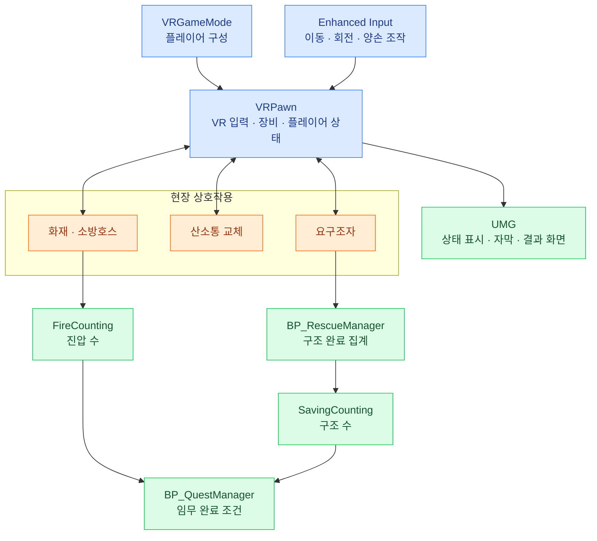
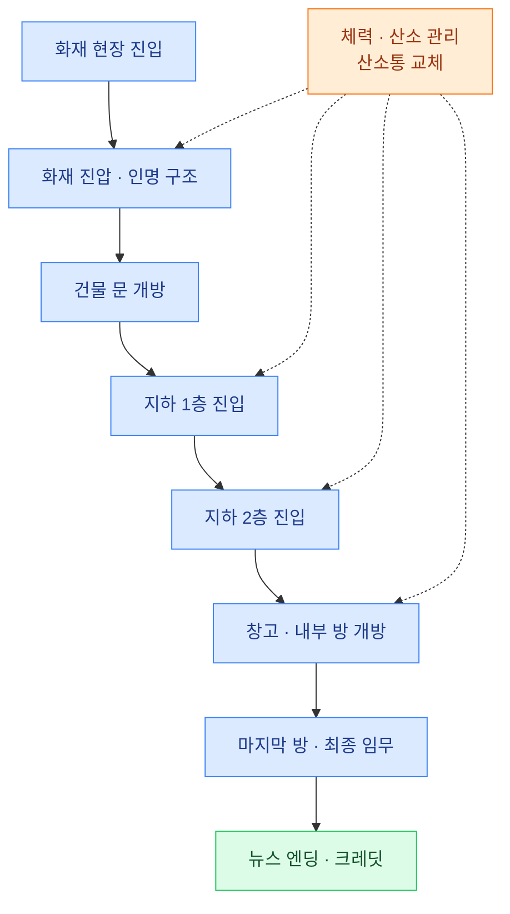

# VR 소방·인명 구조 — UE5 개인 창작게임

소방관이 되어 화재 현장에 진입하고, **화재 진압·인명 구조·산소 관리**를 수행하는 **1인칭 VR 창작게임**입니다.

VR 컨트롤러로 소방호스를 조작하고 분사 모드를 변경하며, 건물 내부의 요구조자를 구조합니다. 제한된 산소와 화상에 따른 이동 저하를 고려하면서 지상과 지하 구역의 임무를 진행하도록 구성했습니다.

**GitHub Repository**

**게임 시연 영상**

## 프로젝트 소개

| 항목 | 내용 |
|---|---|
| 개발 기간 | 2024.12.02 ~ 2025.05.26 (6개월) |
| 개발 형태 | 개인 프로젝트 |
| 장르 | 1인칭 VR 소방·인명 구조 창작게임 |
| 플랫폼 | Windows PC / x64 |
| 개발 엔진 | UE5 — Unreal Engine 5.5 |
| 구현 방식 | Blueprint Visual Scripting |
| 프로젝트 구성 | `GRD_Project.uproject` · VR Template 기반 플레이어 · 퀘스트·구조 시스템 · 다층 레벨 |
| 주요 담당 | 게임 규칙 구성, VR 플레이어·소방 장비, 생존·구조·퀘스트 로직, 레벨 구성, UI·연출 통합 |
| 제작/협력 보조 | Oculus · Google Drive · Mixamo |

## 담당 업무

| 영역 | 구현 내용 |
|---|---|
| **VR 플레이어·입력** | VR Template 확장, 양손 컨트롤러 입력, 이동·회전, 소방 장비 조작과 상호작용 연결 |
| **소방 장비·화재** | 호스 분사·모드 전환, 물의 판정 영역과 화재 객체 연결, 진압 수 집계, 화재·폭발 피해 처리 |
| **생존 시스템** | 체력·산소 상태 관리, 실내 산소 소모, 산소통 교체, 화상 위험과 게임오버 구성 |
| **인명 구조·퀘스트** | 요구조자 상호작용, 구조 완료 집계, 단계별 목표 조건, 문 개방과 마지막 임무 연결 |
| **레벨 구성** | 메인 공간·지하 1층·지하 2층 구성, 구역 트리거와 레벨 스트리밍 연결 |
| **UI·연출** | 체력·산소·구조 현황 표시, 튜토리얼·상호작용 안내, 자막·음성, 폭발·카메라 셰이크, 뉴스 엔딩·크레딧 |

UE5 VR Template과 외부 모델·애니메이션·이펙트 자산을 활용하고, 소방·구조 게임 규칙에 맞게 블루프린트와 레벨을 구성했습니다. 플레이어 상태, 현장 상호작용, 임무 조건과 화면 안내를 연결하는 부분을 중심으로 구현했습니다.

## 핵심 기술

### 1. VR Template 확장과 Enhanced Input 기반 조작

`VRGameMode`와 `VRPawn`을 중심으로 VR 플레이어를 구성했습니다. `VRPawn`의 카메라와 양손 **Motion Controller Component**를 기반으로 시점·손 조작을 처리하고, 소방 장비와 게임 상태를 연결했습니다.

- **OpenXR:** VR 장치 연동을 위한 런타임 인터페이스로 사용합니다.
- **Enhanced Input:** 이동·회전·좌우 손 조작을 Input Action으로 구분하고, `IMC_Default`·`IMC_Hands` 등의 Input Mapping Context로 입력을 구성합니다.
- **장비 입력:** 컨트롤러의 분사 입력과 분사 모드 변경 입력을 소방호스 동작에 연결합니다.
- **손 표현:** `B_MannequinsXR`·`ABP_MannequinsXR` 및 손가락 입력 액션을 활용해 VR 손 표현을 구성합니다.
- **상호작용:** 플레이어 입력과 대상의 상호작용 영역을 연결하여 산소통 교체와 인명 구조에 사용합니다.

플레이어 조작은 `VRPawn`, 진행 조건은 퀘스트·구조 관리자, 상태 표시는 위젯이 담당하는 구성입니다.

### 2. Overlap 이벤트 기반 소방 장비와 피해 판정

소방 장비의 시각적 분사 효과와 실제 판정 영역을 함께 구성했습니다. `VRPawn`에는 분사 영역인 **`FH_WaterRange`·`FS_WaterRange`**가 있으며, 각 영역의 **Begin/End Overlap 이벤트**를 통해 화재 객체와의 접촉을 처리합니다.

- **분사 모드 전환:** 서로 다른 분사 표현과 판정 영역을 플레이어 조작에 연결합니다.
- **화재 진압:** `BP_Fire`와 물의 판정 영역을 연동하고, 화재 객체 정리와 `FireCounting` 집계에 사용합니다.
- **화재 피해:** 화재 객체의 피해 영역과 플레이어의 피해 판정 컴포넌트를 구성합니다.
- **폭발 피해:** `BP_Explosion`에 `Damage Area100`·`Damage Area50` 영역을 나누어 배치하고 `PlayerHP`와 연결합니다.
- **시각·청각 피드백:** 화염·물·폭발 이펙트와 사운드를 배치하고, 폭발에는 카메라 셰이크를 함께 구성합니다.

물 분사는 `BP_FireHydrant`·`BP_FireSprinkler`의 효과를 활용하고, 화염에는 Niagara 자산을 사용했습니다. 폭발은 파티클 생성과 사운드 재생을 묶어 현장 이벤트를 표현합니다.

### 3. 체력·산소 관리와 산소통 교체

플레이어의 생존 상태는 `VRPawn`의 **`PlayerHP`·`PlayerO2`**와 최대치 **`MaxHP`·`MaxO2`**를 중심으로 관리합니다. 체력과 산소는 다른 위험 요소로 설계했습니다.

| 요소 | 게임 규칙·역할 | 연결 요소 |
|---|---|---|
| **체력** | 화재와 폭발에 따른 피해를 반영하는 생존 수치 | `PlayerHP` · 화재·폭발 판정 영역 |
| **화상** | 불에 가까이 접근할수록 위험해지며, 이동 저하와 회복 불가 규칙으로 신중한 진입 유도 | 플레이어 피해 처리 · 튜토리얼 안내 |
| **산소** | 건물 내부에서 소모되며, 부족할수록 임무 수행이 어려워지는 제한 자원 | `PlayerO2` · 실내 구역 |
| **산소통 교체** | 건물 주변의 교체 지점에서 산소를 보충하는 상호작용 | `BP_GasStation` · `Change Area` |
| **상태 표시** | 체력·산소의 현재값과 최대값을 위젯의 표시 수치에 연결 | `WBP_Screen` · Progress Bar |

`BP_GasStation`은 교체 영역의 진입·이탈 이벤트와 플레이어의 산소 상태를 연결합니다. 산소통 안내 위젯 `WBP_GasBin`과 외곽선 머티리얼 `M_GasOutline`을 함께 사용해 교체 지점을 구분하도록 구성했습니다.

화재 진압과 구조에 시간을 쓰는 동안 산소도 관리해야 하므로, 계속 전진할지 보급 지점으로 돌아갈지를 판단하는 플레이를 목표로 했습니다.

### 4. 인명 구조 집계와 단계별 퀘스트

요구조자는 `CBP_RSC01`~`CBP_RSC12` 블루프린트로 구성하고, **`BP_RescueManager`**를 통해 구조 완료를 집계합니다. 각 요구조자의 `Interaction Area`에서 플레이어의 진입·이탈을 감지하고, 상호작용 상태와 구조 완료 처리를 연결했습니다.

- **대상별 상호작용:** 요구조자의 위치에 진입한 플레이어가 구조 동작을 수행하는 방식입니다.
- **구조 완료 집계:** `Rescue_Success`와 `SavingCounting`을 중심으로 구조 결과를 반영합니다.
- **임무 상태 관리:** `BP_QuestManager`에 1~8번 퀘스트와 마지막 임무의 완료 상태를 구분합니다.
- **목표 조건 연결:** `FireCounting`·`SavingCounting`을 퀘스트 관리자에서 참조하여 진압·구조 진행과 목표 조건을 연결합니다.
- **개별 임무 처리:** `BP_Quest01`~`BP_Quest08` 및 `BP_LastQuest`가 문 개방·구역 진입·최종 진행을 구성합니다.

퀘스트는 건물 진입부터 지하층과 내부 방을 거쳐 마지막 임무에 도달하는 흐름입니다. 마지막 임무의 `EndingNews Control`을 통해 뉴스 형식의 엔딩 화면과 연결합니다.

### 5. 구역 트리거와 레벨 스트리밍

`MainLevel`을 시작 맵으로 두고, 지하 공간을 **`B1_Floor`·`B2_Floor`**로 구분했습니다. 각 층의 구역 블루프린트를 통해 공간 진입과 레벨 로딩을 연결합니다.

- **층별 구역:** `BP_F1Area`·`BP_B1Area`·`BP_B2Area`로 지상과 지하 구역을 구분합니다.
- **레벨 전환:** 지하 구역 블루프린트에서 `LoadStreamLevel`·`UnloadStreamLevel`을 사용합니다.
- **임무 연동:** 지하층 진입 퀘스트와 각 구역의 배치를 연결해 다음 목표 공간으로 진행하도록 구성합니다.
- **환경 구성:** 도시·창고·설비 관련 외부 환경 자산을 화재 현장에 맞게 배치하고, 화재·구조 대상·보급 지점·상호작용 트리거를 추가했습니다.

층별 공간과 임무용 객체를 나누어 관리하고, 플레이어의 위치와 진행 상황에 맞춰 필요한 공간을 연결하는 방식입니다.

### 6. UMG 상태 표시와 자막·엔딩 연출

**UMG Widget Blueprint**로 플레이어 상태와 진행 안내를 구성했습니다. `WBP_Screen`에서 체력·산소의 현재값과 최대값, 구조 집계 값을 참조하고, Progress Bar와 UI 머티리얼로 화면에 표시합니다.

| 구분 | 구성 |
|---|---|
| **상태 UI** | `WBP_Screen` · `WBP_ProgressBar` — 체력·산소·구조 현황 표시 |
| **상호작용 안내** | `WBP_GasBin` 및 대상 안내 위젯 — 산소통 교체와 현장 상호작용 안내 |
| **튜토리얼** | VR 조작·분사 모드·체력·산소 규칙을 이미지와 안내 문구로 전달 |
| **진행 자막** | `WBP_Intro` · 단계별 Subtitle 위젯 — 건물 진입·지하층 이동·폭발 등 상황 전달 |
| **게임오버** | `WBP_GameOver` — 실패 상황의 결과 화면 |
| **엔딩** | `WBP_EndingNews` · `WBP_EndingCredit` — 뉴스 형식의 마무리와 크레딧 |

자막 트리거 블루프린트와 상황별 음성·사운드 자산을 구성하고, `VRPawn`의 화면·엔딩 제어와 연결했습니다. Timeline과 Timer 노드를 활용한 연출 제어를 포함하며, 화면 상태와 사운드를 게임 진행에 맞춰 전환하도록 구성했습니다.

## 대표 블루프린트·자산

아래 경로는 프로젝트의 `Content` 폴더 기준입니다.

| 기능 | 대표 자산 | 역할 |
|---|---|---|
| VR 플레이어 | `VRTemplate/Blueprints/VRPawn.uasset` | 입력·장비·체력·산소·화면 제어 |
| 게임 기본 구성 | `VRTemplate/Blueprints/VRGameMode.uasset` | 기본 플레이어와 컨트롤러 구성 |
| 입력 매핑 | `VRTemplate/Input/IMC_Default.uasset` · `IMC_Hands.uasset` | 기본 조작과 손 입력 구성 |
| 화재 객체 | `Vefects/Free_Fire/Shared/Particles/BP_Fire.uasset` | 화염 효과·접촉 처리·진압 집계 연결 |
| 물 분사 | `Vefects/Immigrate/FireHydrant/Blueprints/BP_FireHydrant.uasset` | 소방 장비의 물 분사 효과 |
| 산소통 교체 | `BlueprintsA/BP_GasStation.uasset` | 교체 영역·산소 수치·안내 위젯 연결 |
| 폭발 | `BlueprintsA/BP_Explosion.uasset` | 영역별 피해·이펙트·사운드·카메라 셰이크 |
| 인명 구조 | `BlueprintsA/Rescue/BP_RescueManager.uasset` · `CBP_RSC01.uasset` 등 | 요구조자 상호작용과 구조 완료 집계 |
| 퀘스트 | `BlueprintsA/Quest/BP_QuestManager.uasset` · `BP_LastQuest.uasset` | 목표 완료 상태와 마지막 임무·엔딩 연결 |
| 구역 전환 | `BlueprintsA/Quest/LevelLayer/BP_B1Area.uasset` · `BP_B2Area.uasset` | 구역 진입과 레벨 스트리밍 |
| 상태 UI | `BlueprintsA/WBP_Screen.uasset` · `WBP_ProgressBar.uasset` | 체력·산소·구조 상태 표시 |
| 자막·엔딩 | `BlueprintsA/Subtitle/` · `BlueprintsA/WBP_EndingNews.uasset` · `WBP_EndingCredit.uasset` | 상황 안내와 뉴스 엔딩·크레딧 |
| 게임 맵 | `Maps/MainLevel.umap` · `B1_Floor.umap` · `B2_Floor.umap` | 메인 공간과 지하층 구성 |

## 개발 환경·기술 스택

| 분류 | 기술·도구 | 적용 내용 |
|---|---|---|
| **게임 엔진** | Unreal Engine 5.5 | VR 게임 구성, 레벨 편집, 자산·게임플레이 통합 |
| **게임 로직** | Blueprint Visual Scripting | 플레이어·화재·구조·퀘스트·UI 로직 구현 |
| **게임 프레임워크** | VR Template · GameMode · Pawn · PlayerController | 기본 VR 구성과 소방 게임 규칙 연결 |
| **VR 장치 연동** | OpenXR · Motion Controller Component | 헤드셋·양손 컨트롤러 연동과 장비 조작 |
| **입력** | Enhanced Input · Input Action · Input Mapping Context | 이동·회전·분사·모드 전환·손 입력 구성 |
| **충돌·상호작용** | Collision Component · Begin/End Overlap | 물·화재 판정, 피해 영역, 구조·산소통 교체 트리거 |
| **UI** | UMG · Widget Blueprint · Widget Component | 상태 바, 상호작용 안내, 자막, 게임오버·엔딩 |
| **이펙트·머티리얼** | Niagara · Particle System · Material/Material Instance | 화염·물·폭발, 외곽선, 상태 UI 표현 |
| **애니메이션** | Skeletal Mesh · Animation Blueprint · Animation Asset | VR 손 표현과 요구조자 애니메이션 구성 |
| **진행·연출 제어** | Blueprint Event · Timeline · Timer · Camera Shake | 상태 갱신, 시간에 따른 연출, 폭발 피드백 |
| **레벨 관리** | Level Streaming · LoadStreamLevel · UnloadStreamLevel | 지하층 로딩·해제와 구역 전환 |
| **오디오** | UE 오디오 시스템 · 음성·효과음 자산 | 화재·폭발·사이렌·상황별 음성 안내 |
| **제작/협력 보조** | Oculus · Google Drive · Mixamo | VR 장비 활용, 자료 보관·공유, 캐릭터·애니메이션 제작 보조 |
